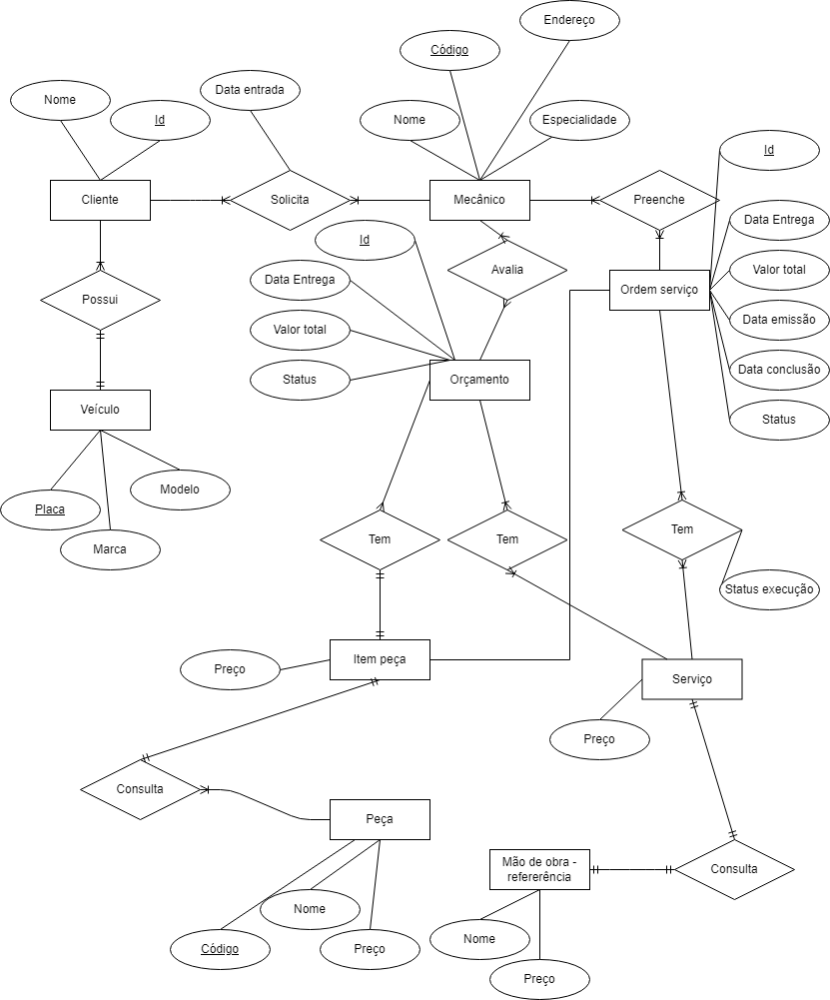
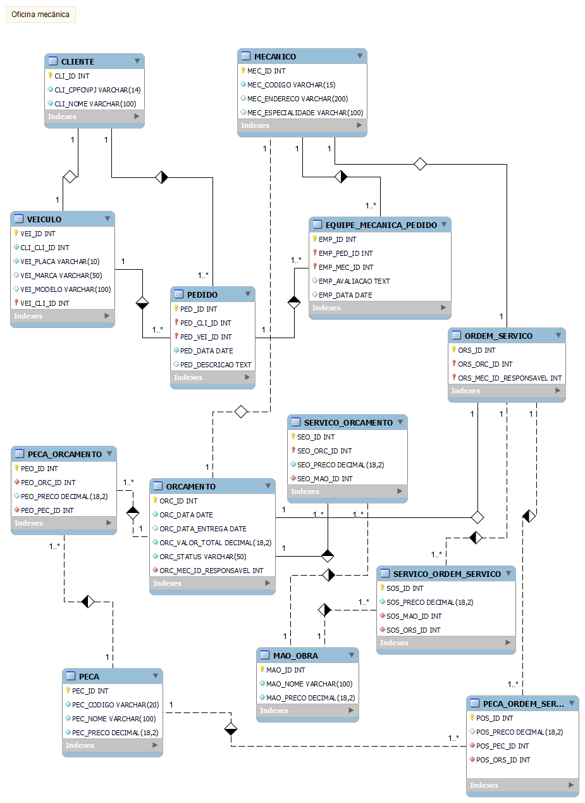

# Modelo conceitual e ER de oficina mecânica
Desafio do bootcamp da DIO referente ao bootcamp Database Experience, que tem por objetivo a construção de um modelo lógico de banco de dados referente a uma oficina mecânica.
As etapas são a construção de um modelo em alto nível com a visão de mini mundo denominado diagrama conceitual e posteriormente o mapeamento deste modelo para um modelo (ER) entidade / relacionamento.

## Objetivo:

Cria o esquema conceitual para o contexto de oficina com base na narrativa fornecida.

### Narrativa 

 - Sistema de controle e gerenciamento de execução de ordens de serviço em uma oficina mecânica;
 - Clientes levam veículos à oficina mecânica para serem consertados ou para passarem por revisões  periódicas;
 - Cada veículo é designado a uma equipe de mecânicos que identifica os serviços a serem executados e preenche uma OS com data de entrega;
 - A partir da OS, calcula-se o valor de cada serviço, consultando-se uma tabela de referência de mão-de-obra;
 - O valor de cada peça também irá compor a OSO cliente autoriza a execução dos serviços;
 - A mesma equipe avalia e executa os serviços;
 - Os mecânicos possuem código, nome, endereço e especialidade;
 - Cada OS possui: n°, data de emissão, um valor, status e uma data para conclusão dos trabalhos;

## Detalhes

### diretório modelo
Arquivo utilizado para construção do modelo conceitual.
Arquivo utilizado para construção do modelo ER.

### modelo conceitual 
Foi utilizado a ferramenta *Draw.io* para a construção.

### modelo ER entidade relacionamento
Para o modelo ER foi utilizado uma sigla de 3 caracteres que identifica cada tabela. 
Esta sigla irá preceder cada nome de coluna de forma que o nome da coluna nunca se repita em qualquer tabela. 

#### sigla x tabela 
|sigla |tabela                              |
   --- |                                --- |
|CLI   | CLIENTE                            |
|EMP   | EQUIPE_MECANICA_PEDIDO             |
|MAO   | MAO_OBRA                           |
|MEC   | MECANICO                           |
|ORC   | ORCAMENTO                          |
|ORS   | ORDEM_SERVICO                      |
|PEC   | PECA                               |
|PEO   | PECA_ORCAMENTO                     |
|POS   | PECA_ORDEM_SERVICO                 |
|PED   | PEDIDO                             |
|SEO   | SERVICO_ORCAMENTO                  |
|SOS   | SERVICO_ORDEM_SERVICO              |
|VEI   | VEICULO                            |

Foi utilizado a ferramenta *Mysql Workbench* para a construção.

## Referências
- Ferramenta de construção de diagramas **[Draw.io](https://app.diagrams.net/)**:  
<https://app.diagrams.net/>

- Ferramenta utilizada para construção do modelo ER (entidade x relacionamento) **[Mysql Workbench](https://www.mysql.com/products/workbench/)**:  
<https://www.mysql.com/products/workbench/>